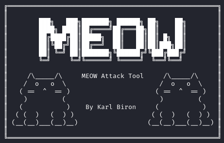
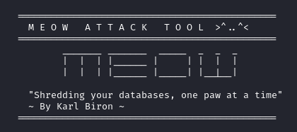
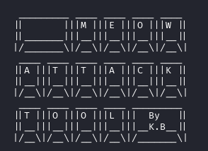
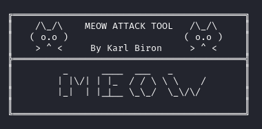
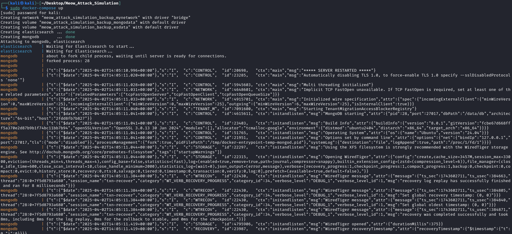
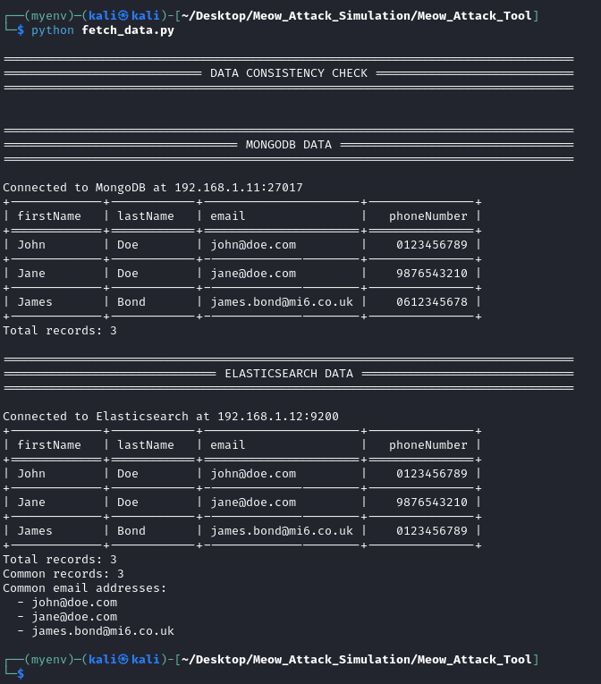
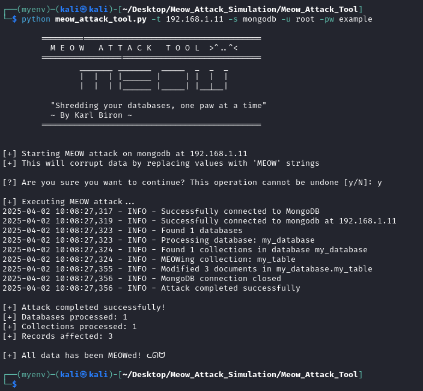
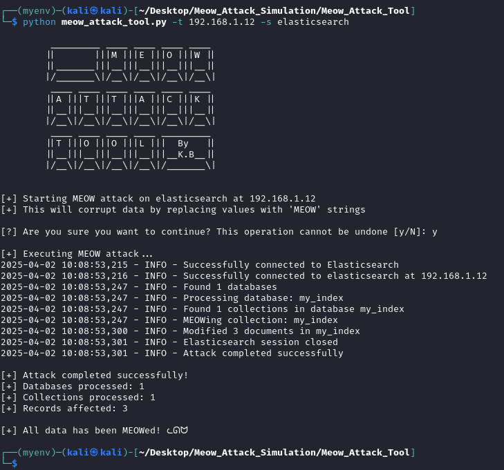
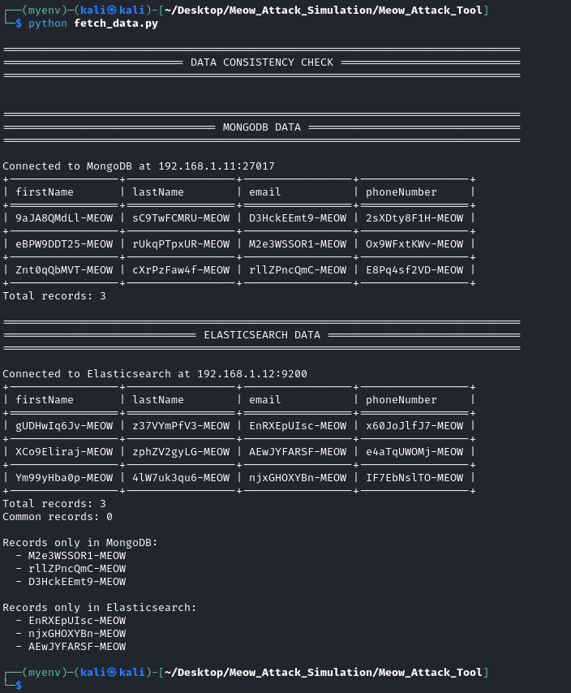

# Meow Attack Simulation Tool


## NOTES

The Meow Attack Script is now a Meow Attack Tool. The tool can currently accomodate for MongoDB and Elasticsearch targets. In additon, the credentialed attack feature has been added.

## Installation

```bash
# Clone the repository
git clone https://github.com/karlvbiron/Meow_Attack_Simulation.git

# Navigate to the tool directory
cd Meow_Attack_Simulation/Meow_Attack_Tool

# Install dependencies
pip install -r requirements.txt
```

## Command Line Arguments

| Argument | Description |
|----------|-------------|
| `-l`, `--list` | List supported database services |
| `-t`, `--target` | Target host IP address |
| `-s`, `--service` | Database service to attack (e.g., mongodb, elasticsearch) |
| `-p`, `--port` | Port number (if not default) |
| `-u`, `--username` | Username for authentication |
| `-pw`, `--password` | Password for authentication |
| `-v`, `--verbose` | Enable verbose output |

## Example Scenarios

### MongoDB Simulation (Credentialed)

```bash
python meow_attack_tool.py -t 192.168.1.11 -s mongodb -u root -pw example
```

### Elasticsearch Simulation (Non-Credentialed)

```bash
python meow_attack_tool.py -t 192.168.1.12 -s elasticsearch
```

## Project Structure

```
Meow_Attack_Tool/
├── init.py
├── core/
│   ├── init.py
│   ├── base_attacker.py
│   └── attack_factory.py
├── attackers/
│   ├── init.py
│   ├── mongodb.py
│   └── elasticsearch.py
├── utils/
│   ├── init.py
│   └── logging.py
└── meow_attack_tool.py
```

## Banners 

 
 \



## Attack Sequence Demonstartion







## Disclaimer

This tool is provided for **EDUCATIONAL PURPOSES ONLY**. It is designed to demonstrate a type of cyber attack in a controlled environment to help improve security awareness and defensive measures. Using this tool against systems without proper authorization is illegal and unethical. The authors and contributors are not responsible for any misuse of this software.

## License

This project is licensed under the MIT License - see the LICENSE file for details.
